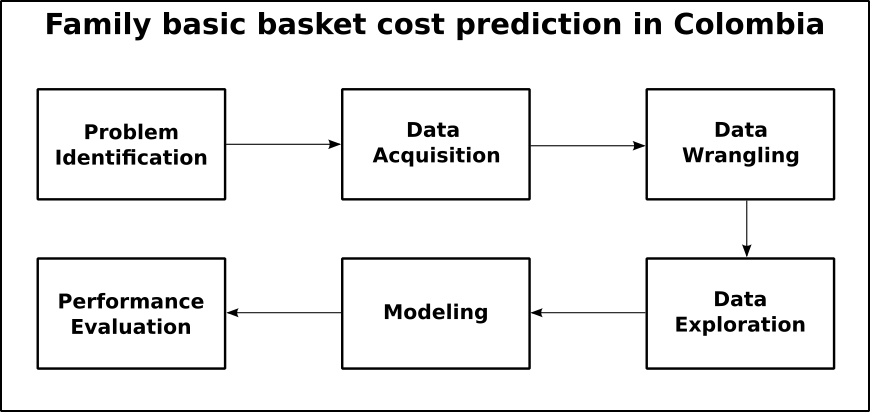
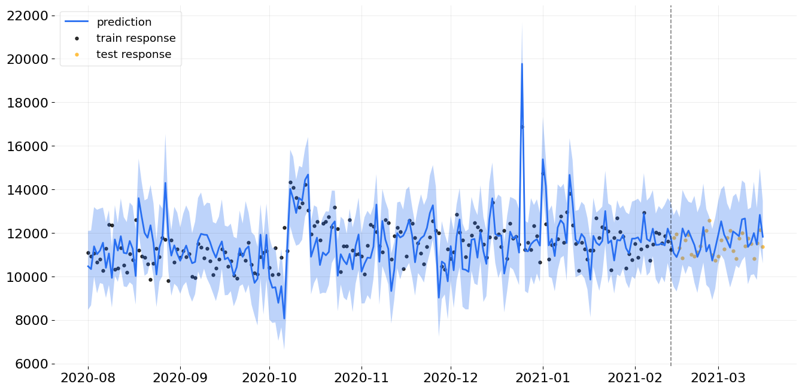
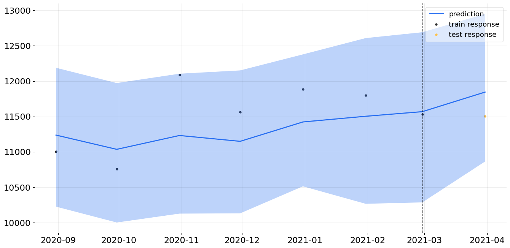

<!--
*** Thanks for checking out the Best-README-Template. If you have a suggestion
*** that would make this better, please fork the repo and create a pull request
*** or simply open an issue with the tag "enhancement".
*** Thanks again! Now go create something AMAZING! :D
***
***
***
*** To avoid retyping too much info. Do a search and replace for the following:
*** github_username, repo_name, twitter_handle, email, project_title, project_description
-->

<!-- PROJECT SHIELDS -->
<!--
*** I'm using markdown "reference style" links for readability.
*** Reference links are enclosed in brackets [ ] instead of parentheses ( ).
*** See the bottom of this document for the declaration of the reference variables
*** for contributors-url, forks-url, etc. This is an optional, concise syntax you may use.
*** https://www.markdownguide.org/basic-syntax/#reference-style-links
-->

<!-- PROJECT LOGO -->
 

  

  <h2 align="center">Family basic basket cost prediction in Medellín</h2>

  

    Objective:
    Design a model that allows the basic family basket prices time series in Medellin using some related municipalities and variables such as TRM and ACPM.
     
    <a href="https://github.com/morbid-face/ProyectoEquipo3_eafit"><strong>Explore the docs »</strong></a>
     
     
    <a href="https://github.com/morbid-face/ProyectoEquipo3_eafit">View Demo</a>
    ·
    <a href="https://github.com/morbid-face/ProyectoEquipo3_eafit/issues">Report Bug</a>
    ·
    <a href="https://github.com/morbid-face/ProyectoEquipo3_eafit/issues">Request Feature</a>
  

<!-- TABLE OF CONTENTS -->

  
<h2 style="display: inline-block">Table of Contents</h2>

  <ol>
    <li>
      <a href="#about-the-project">About The Project</a>
      <ul>
        <li><a href="#built-with">Built With</a></li>
      </ul>
    </li>
    <li><a href="#roadmap">Roadmap</a></li>
    <li><a href="#resoults">Resoults</a></li>
    <li><a href="#conclusions">Conclusions</a></li>
  </ol>

<!-- ABOUT THE PROJECT -->
## About The Project

<!--[![Product Name Screen Shot][product-screenshot]](https://example.com)-->

The prices of the basic family basket depend on many factors, among them the cost of transportation, gasoline, fertilizers, dollar, among others. Forecasting the prices of the basic family basket would represent a great advantage for Colombian families when budgeting their expenses and having a better understanding of price variations. 

Since factors such as location, road conditions and food production are very particular to each municipality, it was decided to address the problem at a regional level.

### Built With

* [Databricks](https://databricks.com/)
* [Orbit](https://github.com/uber/orbit)

<!-- ROADMAP -->
## Roadmap

  

<!-- RESULTS -->
## Resoults
Basic family basket prices during a month using the most correlated municipalities.
Here we get a MAPE of 5.278%

  

Basic family basket prices during a month using the most correlated municipalities and including ACPM cost.
Here we get a MAPE of 2.976%. 

  

<!-- CONCLUSIONS -->
## Conclusions
Some external factors such as TRM may not have a strong influence in the basic family basket forecas. While others like ACPM price, may be very relevant for making predictions.
In order to improve the performance of the model; the amount of data must be increased. Also, taking into account more factors like price of fertilizers, farm labor, etc could have a positive impact in the performance.

Project Link: [https://github.com/morbid-face/ProyectoEquipo3_eafit](https://github.com/morbid-face/ProyectoEquipo3_eafit)

<!-- MARKDOWN LINKS & IMAGES -->
<!-- https://www.markdownguide.org/basic-syntax/#reference-style-links -->
[contributors-shield]: https://img.shields.io/github/contributors/morbid-face/repo.svg?style=for-the-badge
[contributors-url]: https://github.com/morbid-face/repo/graphs/contributors
[forks-shield]: https://img.shields.io/github/forks/morbid-face/repo.svg?style=for-the-badge
[forks-url]: https://github.com/morbid-face/repo/network/members
[stars-shield]: https://img.shields.io/github/stars/morbid-face/repo.svg?style=for-the-badge
[stars-url]: https://github.com/morbid-face/repo/stargazers
[issues-shield]: https://img.shields.io/github/issues/morbid-face/repo.svg?style=for-the-badge
[issues-url]: https://github.com/morbid-face/repo/issues
[license-shield]: https://img.shields.io/github/license/morbid-face/repo.svg?style=for-the-badge
[license-url]: https://github.com/morbid-face/repo/blob/master/LICENSE.txt
[linkedin-shield]: https://img.shields.io/badge/-LinkedIn-black.svg?style=for-the-badge&logo=linkedin&colorB=555
[linkedin-url]: https://linkedin.com/in/morbid-face
